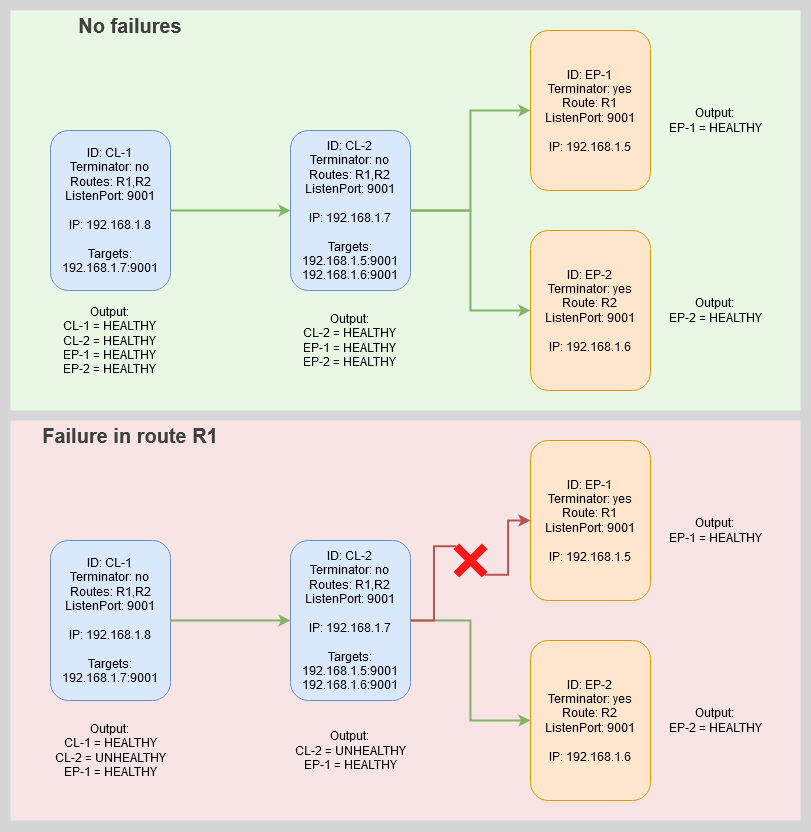

# l7-snake
Simple gRPC L7 tracer for network troubleshooting.

## How to run
- Compile the binary with (standard go)
- Run it from the CLI
- A default config gets generated (you can kill the app anytime and adjust the config)
  - Config
    - ID = Name of your node
    - LISTENPORT = Port your node listens to
    - TARGETS = List of targets you want to poke (format IP:PORT)
    - ROUTES = Arbitrary tags for human readable tracing
    - TERMINATOR = Decides if your node is the last link of the chain or not
    - INTERVAL = Poking interval (format 1ms,1s,1m,1h)
  - Flags
    - By using the flag "-config" you can set a path for your config file

## Intention
Distributed networks often get confusing, so I decided to code a little helper. Since I am not a programmer, I never used gRPC and wanted to give it a try.

I like it and the helper tool "L7-Snake" is sufficient for a low-level network overview when tools like SDNs (NSX, Nuage, Midonet), Meshes (Istio, LinkerD, etc.), Monitoring (Icinga, Nagios, Datadog, etc.) or other analysis is limited.

Especially for gated networks (subnet locks) it does serve me well.

Enjoy :)

## Further improvement
Everyone is welcome to submit issues.

Further tasks are:
- add SSL/TLS
- cleanup output for multi-target clients
- add Frontend
- implement live route changes (add,delete,change) with REST
- add database connector for timebased analysis

## Infos
I compiled with:
- CGO_ENABLED = 1
- go build -ldflags='-s -w -extldflags "-static"' main.go

I used (on my local machine) upx for binary compression with:
- upx --best l7-snake (and got it to ~2810KB with full functionality)

Hint: _On Windows the compression flag --brute or --ultra-brute throw a false positive with Windows Defender, so I would only use the --best flag._

## Schematic
